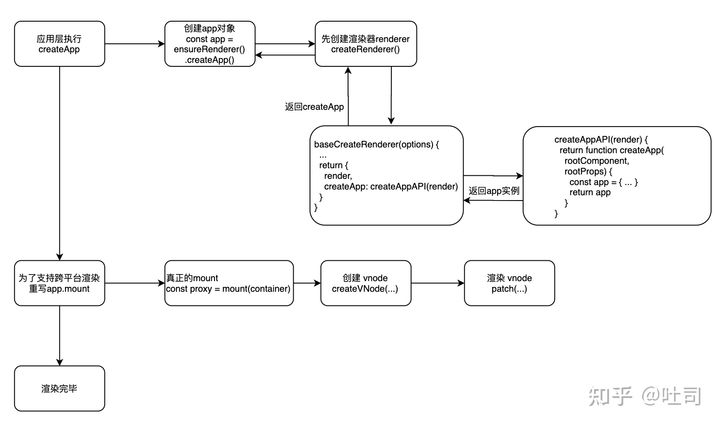

# 初始化流程原理
## createApp的首次渲染

### 1.createApp入口
在 vue3 中，是通过createApp的方式进行创建新的 Vue 实例，所以我们可以直接顺着createApp往下看。
```javascript
// 从 createApp 开始
// vue3.0 中初始化应用
import { createApp } from 'vue'

const app = {
  template: '<div>hello world</div>'
}

const App = createApp(app)
// 把 app 组件挂载到 id 为 app 的 DOM 节点上
App.mount('#app')
```

#### createApp的渲染流程

用户调用的createApp函数就在这里被声明，用户调用的是 runtime-dom ，内部再调用 runtime-core，runtime-dom 是用来解决平台差异（浏览器）

新建 runtime-dom/src/index.ts文件
```javascript
// runtime-dom 操作节点、操作属性更新
import { createRenderer } from "@vue/runtime-core/src/index";
import { extend } from "@vue/shared/src";
import { nodeOps } from "./nodeOps";        // 对象
import { patchProp } from "./patchProp";    // 方法
​
// 渲染时用到的所有方法
const rendererOptions = extend({patchProp},nodeOps);
​
// vue中 runtime-core 提供了核心的方法，用来处理渲染的，他会使用runtime-dom 中的 api 进行渲染
export function createApp(rootComponent,rootProps = null){
    const app = createRenderer(rendererOptions).createApp(rootComponent,rootProps)
    let { mount } = app
    app.mount = function (container){
        // 清空容器
        container = document.querySelector(container);
        container.innerHTML = '';
        mount(container);   //函数劫持
        // 将组件渲染成DOM元素，进行挂载
    }
    return app;
}
​
// export * from '@vue/runtime-core' // 后续将 runtime-core 中的方法都在这里暴露
```

### 创建 app 对象
createApp的内部比较清晰，先是创建了 app 对象，之后是改写了 mount 方法， 最后返回了这个 app 实例。在这里可以发现，真正的 createApp 方法是在渲染器createRenderer属性上的。 在 vue3 中使用 monorepo 的方式对很多模块做了细粒度的包拆分，比如核心的响应式部分放在了 packages/reactivity 中，创建渲染器的 createRenderer 方法放在了 packages/runtime-core 中。 所以如果没有调用 createApp 这个方法，也就不会调用 createRenderer 方法，那么当前的 runtime-dom 这个包内是可以通过 tree shaking 去避免打包的时候把没有用到的 packages/runtime-core 也打进去。

原始createRenderer函数如下，在createRenderer函数中返回一个createApp()函数，通过柯里化最终返回了App实例
```javascript
// createRenderer 与平台无关所以定义在 runtime-core 中
function createRenderer(rendererOptions) {
    return {
        createApp(rootComponent, rootProps) { // 用户创建app的参数
            const app = {
                mount(container) { // 挂载的容器
                }
            }
            return app;
        }
    }
}
```

#### 完整createRenderer函数

新建runtime-core/src/renderer.ts文件

```javascript
import { createAppAPI } from "./apiCreateApp"
​
export function createRenderer(rendererOptions) { // 渲染时所到的api
    const render = (vnode,container) =>{ // 核心渲染方法
        // 将虚拟节点转化成真实节点插入到容器中
    }
    return {
        createApp:createAppAPI(render)
    }
}
```
这个 createAppAPI 才是我们最终在应用层时调用的。 首先他是返回了一个函数，这样做的好处是通过闭包把 render 方法保留下来供内部来使用。 最后他创建传入的 app 实例，然后返回，我们可以看到这里有一个 mount 方法，但是这个 mount 方法还不能使用，vue 会在之后对这个 mount 方法进行改写，之后才会进入真正的 mount。

新建runtime-core/src/apiCreateApp.ts文件

```javascript
// runtime-code/src/apiCreateApp.ts
import { createVNode } from "./vnode";
export function createAppAPI(render) {
  // 这里返回了一个函数，使用闭包可以在下面 mount 的使用调用 render 方法
  return function createApp(rootComponent, rootProps = null) {
    const context = createAppContext()
    let isMounted = false
    const app = {
      _component: rootComponent,// 组件
      _props: rootProps,// 属性
      _container: null,
      _context: context,
      mount (rootContainer) {
        if (!isMounted) {
          // 创建 root vnode
          const vnode = createVNode(rootComponent, rootProps)		
          // 缓存 context，首次挂载时设置
          vnode.appContext = context
          //执行render渲染vnode
					render(vnode,rootContainer);

          isMounted = true
          // 缓存 rootContainer
          app._container = rootContainer
          rootContainer.__vue_app__= app
          return vnode.component.proxy
        }
      }
      // ... 
    }
    return app
  }
}
```
mount 方法内部的流程也比较清晰，首先是创建 vnode，之后是渲染 vnode，并将其挂载到 rootContainer 上。

### 在runtime-dom/src/index.ts文件中重写 app.mount 方法, 进入真正的 mount

到这里进入改写 mount 方法的逻辑，这里的重写其实也是与平台相关的，在浏览器环境下，会先去获取正确的 DOM 容器节点，判断一切都合法之后，才会调用 mount 方法进入真正的渲染流程中。

```javascript
// 返回挂载的DOM节点
app.mount = (containerOrSelector) => {
  // 获取 DOM 容器节点
  const container = normalizeContainer(containerOrSelector)
  // 不是合法的 DOM 节点 return
  if (!container) return
  // 获取定义的 Vue app 对象, 之前的 rootComponent
  const component = app._component
  // 如果不是函数、没有 render 方法、没有 template 使用 DOM 元素内的 innerHTML 作为内容
  if (!isFunction(component) && !component.render && !component.template) {
    component.template = container.innerHTML
  }
  // clear content before mounting
  container.innerHTML = ''
  // 真正的挂载
  const proxy = mount(container)
  
  // ...
  return proxy 
}
```

### 下面是初始化流程图



### createApp
createApp整体是一个闭包，因为它需要用到渲染器（render）和是否进行服务端渲染的配置（hydrate），根据不同的需求场景创建不同的app。可动态配置的闭包是vue“自古以来”很常用的一个技巧，这样的实现灵活巧妙，非常适合多platform多case的设计，让你可以通过一个入口管理多套逻辑且从对外暴露形式上看起来直观合理。

createApp整体设计上是链式的，也就是说app上下文上挂载的方法最终都会把整个上下文暴露出去，从而支持开发者进行链式调用

```javascript
export function createAppAPI<HostElement>(
  render: RootRenderFunction,
  hydrate?: RootHydrateFunction
): CreateAppFunction<HostElement> {
  // 这就是我们示例里的入口createApp，接受根级组件，和组件属性
  return function createApp(rootComponent, rootProps = null) {
    if (rootProps != null && !isObject(rootProps)) {
      __DEV__ && warn(`root props passed to app.mount() must be an object.`)
      rootProps = null
    }

    // 创建vue应用上下文，上下文主要包括 应用本身，设置项，组件、指令注册仓库、混入
    const context = createAppContext()
    // 安装的vue插件
    const installedPlugins = new Set()

    // 应用是否已挂载
    let isMounted = false

    // 为应用上下文装载应用
    const app: App = (context.app = {
      _uid: uid++,
      _component: rootComponent as ConcreteComponent,
      _props: rootProps,
      _container: null,
      _context: context,

      version,

      get config() {
        return context.config
      },

      set config(v) {
        if (__DEV__) {
          warn(
            `app.config cannot be replaced. Modify individual options instead.`
          )
        }
      },

      // 装载vue插件的入口，就是把插件存入集合
      use(plugin: Plugin, ...options: any[]) {
        if (installedPlugins.has(plugin)) {
          __DEV__ && warn(`Plugin has already been applied to target app.`)
        } else if (plugin && isFunction(plugin.install)) {
          installedPlugins.add(plugin)
          plugin.install(app, ...options)
        } else if (isFunction(plugin)) {
          installedPlugins.add(plugin)
          plugin(app, ...options)
        } else if (__DEV__) {
          warn(
            `A plugin must either be a function or an object with an "install" ` +
              `function.`
          )
        }
        return app
      },

      mixin(mixin: ComponentOptions) {
        if (__FEATURE_OPTIONS_API__) {
          if (!context.mixins.includes(mixin)) {
            context.mixins.push(mixin)
            // global mixin with props/emits de-optimizes props/emits
            // normalization caching.
            if (mixin.props || mixin.emits) {
              context.deopt = true
            }
          } else if (__DEV__) {
            warn(
              'Mixin has already been applied to target app' +
                (mixin.name ? `: ${mixin.name}` : '')
            )
          }
        } else if (__DEV__) {
          warn('Mixins are only available in builds supporting Options API')
        }
        return app
      },

      // 全局组件注册，入参为组件名、组件options
      component(name: string, component?: Component): any {
        if (__DEV__) {
          validateComponentName(name, context.config)
        }
        if (!component) {
          return context.components[name]
        }
        if (__DEV__ && context.components[name]) {
          warn(`Component "${name}" has already been registered in target app.`)
        }
        context.components[name] = component
        return app
      },

      // 全局指令注册
      directive(name: string, directive?: Directive) {
        if (__DEV__) {
          validateDirectiveName(name)
        }

        if (!directive) {
          return context.directives[name] as any
        }
        if (__DEV__ && context.directives[name]) {
          warn(`Directive "${name}" has already been registered in target app.`)
        }
        context.directives[name] = directive
        return app
      },

      // 应用挂载主逻辑入口，我们在入口示例中执行的mount就是这里，指定一个dom容器
      // 将vue应用挂载到dom上
      mount(rootContainer: HostElement, isHydrate?: boolean): any {
        if (!isMounted) {
          // 创建根组件对应的vnode（虚拟dom）
          const vnode = createVNode(
            rootComponent as ConcreteComponent,
            rootProps
          )
          // 根组件存储应用上下文
          vnode.appContext = context

          // 模块热替换HMR，定义reload重载入函数，用来在开发者环境进行重新挂载根组件，
          // 完成应用的重载更新
          if (__DEV__) {
            context.reload = () => {
              render(cloneVNode(vnode), rootContainer)
            }
          }

          if (isHydrate && hydrate) {
            // 服务端渲染相关
            hydrate(vnode as VNode<Node, Element>, rootContainer as any)
          } else {
            // 闭包外部传入的渲染器，整个vue渲染的主逻辑控制都是render注入的
            render(vnode, rootContainer)
          }
          // 标记应用已挂载
          isMounted = true
          // 记录根级dom容器
          app._container = rootContainer
          // for devtools and telemetry
          ;(rootContainer as any).__vue_app__ = app

          if (__DEV__ || __FEATURE_PROD_DEVTOOLS__) {
            devtoolsInitApp(app, version)
          }

          return vnode.component!.proxy
        } else if (__DEV__) {
          warn(
            `App has already been mounted.\n` +
              `If you want to remount the same app, move your app creation logic ` +
              `into a factory function and create fresh app instances for each ` +
              `mount - e.g. \`const createMyApp = () => createApp(App)\``
          )
        }
      },

      // 应用卸载主逻辑入口
      unmount() {
        if (isMounted) {
          render(null, app._container)
          if (__DEV__ || __FEATURE_PROD_DEVTOOLS__) {
            devtoolsUnmountApp(app)
          }
        } else if (__DEV__) {
          warn(`Cannot unmount an app that is not mounted.`)
        }
      },

      provide(key, value) {
        if (__DEV__ && (key as string | symbol) in context.provides) {
          warn(
            `App already provides property with key "${String(key)}". ` +
              `It will be overwritten with the new value.`
          )
        }
        // TypeScript doesn't allow symbols as index type
        // https://github.com/Microsoft/TypeScript/issues/24587
        context.provides[key as string] = value

        return app
      }
    })

    return app
  }
}
```