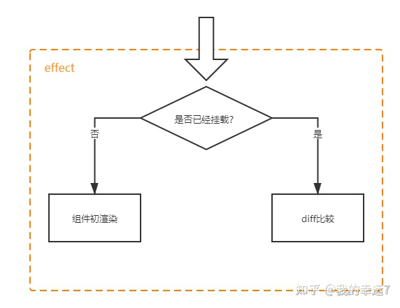
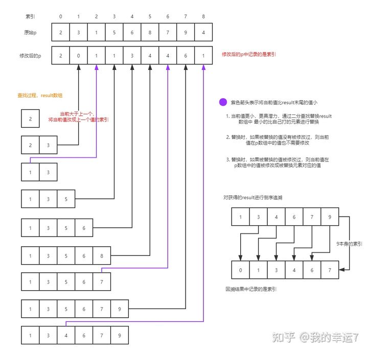

## diff实现原理
### 组件的初渲染和diff算法
组件在初渲染的时候，会根据组件创建effect，所以vue3中是组件级更新，数据变化会重新执行对应组件的effect
- effect执行时通过instance.isMounted判断组件是否已经挂载
- 如果未挂载，就直接通过patch插入节点
- 如果已挂载，就需要做diff比较了
- patch方法是核心，既有初始化的功能，又有比对的功能
```javascript
instance.update = effect(function componentEffect() {
    if (!instance.isMounted) {
        // 初次渲染
    } else {
        const prevTree = instance.subTree;
        const proxyToUse = instance.proxy;
        const nextTree = instance.render.call(proxyToUse, proxyToUse); 
        instance.subTree = nextTree
        patch(prevTree, nextTree, container);
    }
})
```


### 元素比较
前后元素不一致
两个不同虚拟节点不需要比较，直接移除老节点，将新虚拟节点渲染成真实DOM进行挂载即可
```javascript
// h('div', {}, 'hello') 
// h('p', {}, 'world')
const isSameVNodeType = (n1, n2) => {   // 判断是否为同一虚拟节点
    return n1.type == n2.type && n1.key === n2.key
}
const unmount = (vnode)=>{  // 移除元素
    hostRemove(vnode.el); // 未考虑组件情况
}
const patch = (n1, n2, container, anchor = null) => {
    const { shapeFlag, type } = n2;
    if (n1 && !isSameVNodeType(n1, n2)) {
        anchor = hostNextSibling(n1.el); // 获取老元素下一个元素
        unmount(n1);
        n1 = null;
    }
    // ...
}
```
前后元素一致
前后虚拟节点一样，则复用DOM元素，并且更新属性和子节点
```javascript
 const patchElement = (n1, n2, anchor) => {
     // 两个元素相同  1.比较属性 2.比较儿子
     let el = (n2.el = n1.el);
     const oldProps = n1.props || {};
     const newProps = n2.props || {};
     patchProps(oldProps, newProps, el)
     patchChildren(n1, n2, el, anchor);
 }
```
### 属性更新

```javascript
const patchProps = (oldProps, newProps, el) => {
    if (oldProps !== newProps) {
        // 新的属性 需要覆盖掉老的
        for (let key in newProps) {
            const prev = oldProps[key];
            const next = newProps[key];
            if (prev !== next) {
                hostPatchProp(el, key, prev, next);
            }
        }
        // 老的有的属性 新的没有 将老的删除掉
        for (const key in oldProps) {
            if (!(key in newProps)) {
                hostPatchProp(el, key, oldProps[key], null);
            }
        }
    }
}
```

### 儿子节点比较
针对儿子节点类型做基本的diff操作，最复杂的情况莫过于双方都有孩子
```javascript
const unmountChildren = (children) => {
    for(let i = 0; i < children.length; i++){
        unmount(children[i])
    }
}
const patchChildren = (n1, n2, container, anchor = null) => {
    const c1 = n1.children; // 获取所有老的节点
    const c2 = n2.children; // 获取新的所有的节
    const prevShapeFlag = n1.shapeFlag; // 上一次元素的类型 
    const shapeFlage = n2.shapeFlage; // 这一次的元素类型
    
    if(shapeFlag & ShapeFlags.TEXT_CHILDREN){ // 目前是文本元素
        if (prevShapeFlag & ShapeFlags.ARRAY_CHILDREN) { // 老的是数组
            unmountChildren(c1); // 可能有组件 调用组件的卸载方法
        }
        if (c2 !== c1) {
            hostSetElementText(container, c2)
        }
    } else {
        if (prevShapeFlag & ShapeFlags.ARRAY_CHILDREN) { // 新老都是数组
            if (shapeFlag & ShapeFlags.ARRAY_CHILDREN) {
                patchKeydChildren(c1, c2, container, anchor); // core
            } else {
                // 没有新孩子
                unmountChildren(c1);
            }
        } else {
            if (prevShapeFlag & ShapeFlags.TEXT_CHILDREN) {
                // 移除老的文本
                hostSetElementText(container, '');
            }
            if (shapeFlag & ShapeFlags.ARRAY_CHILDREN) {
                // 去把新的元素进行挂在 生成新的节点塞进去
                mountChildren(c2[i], container, anchor);
            }
        }
    }
}
```
### 核心diff算法
当双方儿子都是数组的形式时，会触发核心的diff算法

#### sync from start
从头开始比

```javascript
const patchKeydChildren = (c1, c2, container, anchor) =>{
    let i = 0;
    const l2 = c2.length;
    let e1 = c1.length - 1;
    let e2 = l2 - 1;
    // 1. sync from start
    while(i<=e1 && i<=e2){  // 从头向后比较
        const n1 = c1[i];
        const n2 = c2[i];
        if(isSameVNodeType(n1,n2)){ // 相同就 patch
            patch(n1,n2,container,null)
        }else{  // 不相同就跳出循环
            break;  
        }
        i++;
    }
}

```
#### sync from end
从头比较完，遇到不同的节点时，开始从后向前找相同节点
```javascript
const patchKeydChildren = (c1, c2, container, anchor) =>{
    // 1. sync from start
    // ...
    
    // 2. sync from end
    while (i <= e1 && i <= e2) {    // 从后向前比较
        const n1 = c1[e1];
        const n2 = c2[e2];
        if (isSameVNodeType(n1, n2)) {
            patch(n1, n2, container, null);
        } else {
            break;
        }
        e1--;
        e2--;
    }
}

```
#### common sequence + mount
同序列加挂载
```javascript
const patchKeydChildren = (c1, c2, container, anchor) =>{
    // 1. sync from start
    // ...
    
    // 2. sync from end
    // ...
    
    // 3. common sequence + mount
    if (i > e1) { // 说明有新增 
        if (i <= e2) { // 表示有新增的部分
            // 先根据e2 取他的下一个元素  和 数组长度进行比较
            const nextPos = e2 + 1;
            const anchor = nextPos < c2.length ? c2[nextPos].el : null;
            while (i <= e2) {
                patch(null, c2[i], container, anchor);
                i++;
            }
        }
    }
}

```
#### common sequence + unmount
同序列加卸载

```javascript
const patchKeydChildren = (c1, c2, container, anchor) =>{
    // 1. sync from start
    // ...
    
    // 2. sync from end
    // ...
    
    // 3. common sequence + mount
    if (i > e1) { // 说明有新增 
        // ...
    }else if(i > e2){
        // 4. common sequence + unmount
        while (i <= e1) {
            unmount(c1[i], parentComponent, parentSuspense, true)
            i++
        }
    }
}

```
#### unknow squence
未知序列对比
- 构建映射表
- 查找原先的子节点中有没有可复用的
- 节点移动和复用

```javascript
const patchKeydChildren = (c1, c2, container, anchor) =>{
    // 1. sync from start
    // ...
    
    // 2. sync from end
    // ...
    
    // 3. common sequence + mount
    if (i > e1) { // 说明有新增 
        // ...
    }else if(i > e2){
        // 4. common sequence + unmount
        // ...
    }else{
        // 5. unknow squence
        // 5.1 构建映射表 map
        const s1 = i;
        const s2 = i;
        const keyToNewIndexMap = new Map();
        for (let i = s2; i <= e2; i++) {
            const nextChild = c2[i];
            keyToNewIndexMap.set(nextChild.key, i);
        }
        // 5.2 去老的里面查有没有可以复用的
        const toBePatched = e2 - s2 + 1;
        const newIndexToOldMapIndex = new Array(toBePatched).fill(0);
        for (let i = s1; i <= e1; i++) {
            const prevChild = c1[i];
            let newIndex = keyToNewIndexMap.get(prevChild.key); // 获取新的索引
            if (newIndex == undefined) {
                unmount(prevChild); // 老的有 新的没有直接删除
            } else {
                newIndexToOldMapIndex[newIndex - s2] = i + 1;
                patch(prevChild, c2[newIndex], container);
            }
        }
        // 5.3 移动和挂载
        for (let i = toBePatched - 1; i >= 0; i--) {
            const nextIndex = s2 + i; // [ecdh]   找到h的索引 
            const nextChild = c2[nextIndex]; // 找到 h
            let anchor = nextIndex + 1 < c2.length ? c2[nextIndex + 1].el : null; // 找到当前元素的下一个元素
            if (newIndexToOldMapIndex[i] == 0) { // 这是一个新元素 直接创建插入到 当前元素的下一个即可
                patch(null, nextChild, container, anchor)
            } else {
                // 根据参照物 将节点直接移动过去  所有节点都要移动 （但是有些节点可以不动）
                hostInsert(nextChild.el, container, anchor);
            }
        }
    }
}

```

### 最长递增子序列  
vue中采用最长递增子序列来求解不需要移动的元素有哪些，所以这个算法的目的就是最大限度的减少移动
- 最长递增子序列 的核心是利用了 贪心算法 和 动态规划
- 算法的复杂度为O(nlogn)



实现最长递增子序列
```javascript
function getSequence(arr) { // 最终的结果是索引 
        const len = arr.length;
        const result = [0]; // 索引  递增的序列 用二分查找性能高
        const p = arr.slice(0); // 里面内容无所谓 和 原本的数组相同 用来存放索引
        let start;
        let end;
        let middle;
        for (let i = 0; i < len; i++) { // O(n)
            const arrI = arr[i];
            if (arrI !== 0) {
                let resultLastIndex = result[result.length - 1];
                // 取到索引对应的值
                if (arr[resultLastIndex] < arrI) {
                    p[i] = resultLastIndex; // 标记当前前一个对应的索引
                    result.push(i);
                    // 当前的值 比上一个人大 ，直接push ，并且让这个人得记录他的前一个
                    continue
                }
                // 二分查找 找到比当前值大的那一个
                start = 0;
                end = result.length - 1;
                while (start < end) { // 重合就说明找到了 对应的值  // O(logn)
                    middle = ((start + end) / 2) | 0; // 找到中间位置的前一个
                    if (arr[result[middle]] < arrI) {
                        start = middle + 1
                    } else {
                        end = middle
                    } // 找到结果集中，比当前这一项大的数
                }
                if (arrI < arr[result[start]]) { // 如果相同 或者 比当前的还大就不换了
                    if (start > 0) { // 才需要替换
                        p[i] = result[start - 1]; // 要将他替换的前一个记住
                    }
                    result[start] = i;
                }
            }
        }
        let len1 = result.length // 总长度
        let last = result[len1 - 1] // 找到了最后一项
        while (len1-- > 0) { // 根据前驱节点一个个向前查找
            result[len1] = last
            last = p[last]
        }
        return result;
    }

```