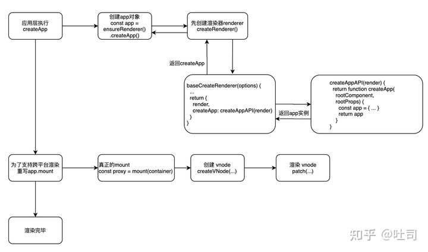
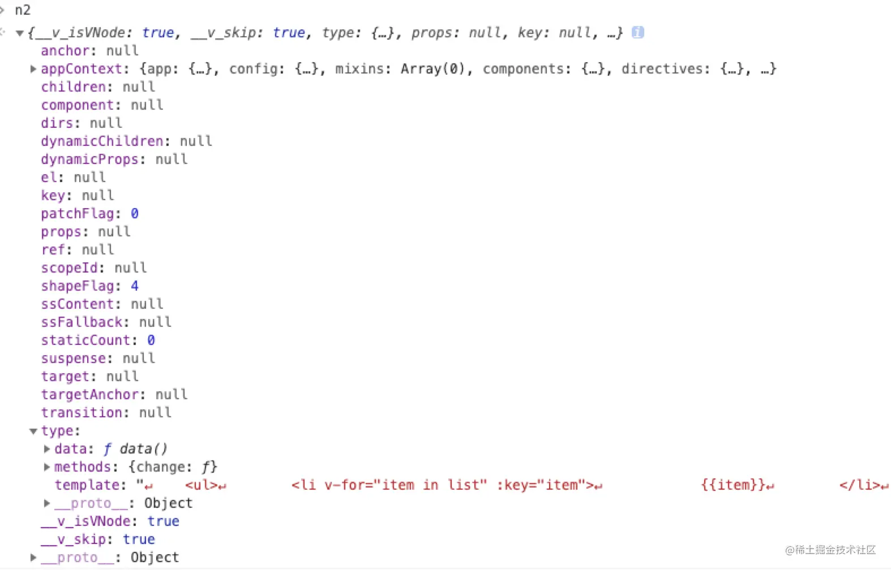
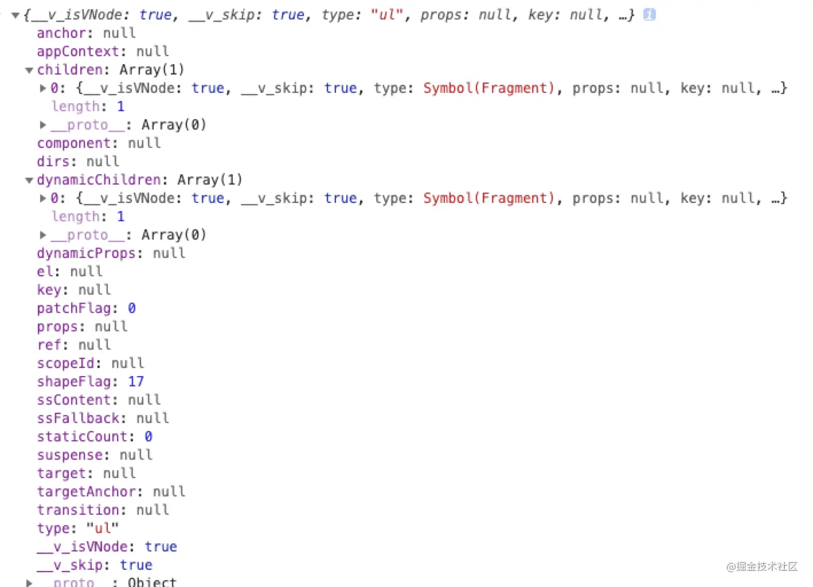
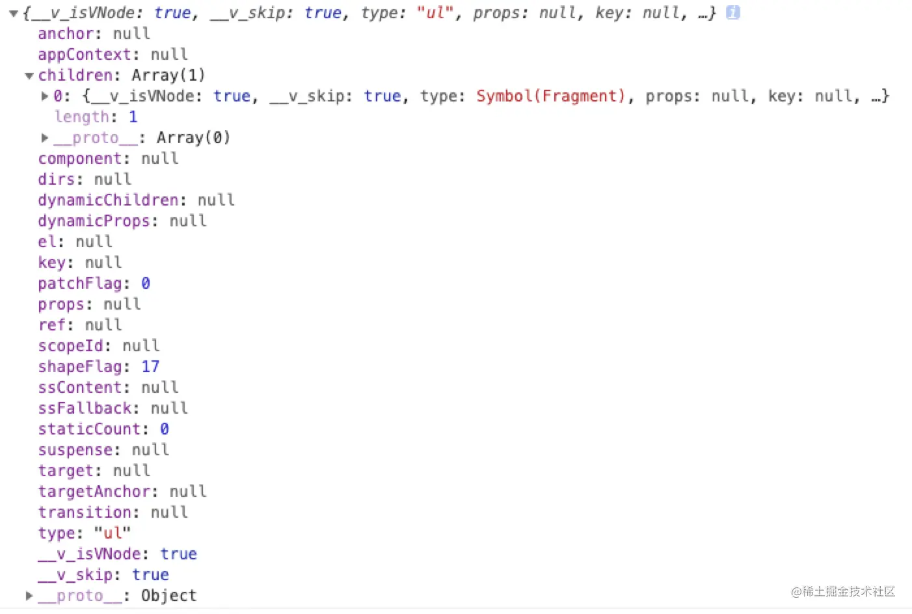

## 下面是初始化流程图



### 1.createApp
createApp整体是一个闭包，因为它需要用到渲染器（render）和是否进行服务端渲染的配置（hydrate），根据不同的需求场景创建不同的app。可动态配置的闭包是vue“自古以来”很常用的一个技巧，这样的实现灵活巧妙，非常适合多platform多case的设计，让你可以通过一个入口管理多套逻辑且从对外暴露形式上看起来直观合理。

createApp整体设计上是链式的，也就是说app上下文上挂载的方法最终都会把整个上下文暴露出去，从而支持开发者进行链式调用

下面是完整的createApp函数

```javascript
export function createAppAPI<HostElement>(
  render: RootRenderFunction,
  hydrate?: RootHydrateFunction
): CreateAppFunction<HostElement> {
  // 这就是我们示例里的入口createApp，接受根级组件，和组件属性
  return function createApp(rootComponent, rootProps = null) {
    if (rootProps != null && !isObject(rootProps)) {
      __DEV__ && warn(`root props passed to app.mount() must be an object.`)
      rootProps = null
    }

    // 创建vue应用上下文，上下文主要包括 应用本身，设置项，组件、指令注册仓库、混入
    const context = createAppContext()
    // 安装的vue插件
    const installedPlugins = new Set()

    // 应用是否已挂载
    let isMounted = false

    // 为应用上下文装载应用
    const app: App = (context.app = {
      _uid: uid++,
      _component: rootComponent as ConcreteComponent,
      _props: rootProps,
      _container: null,
      _context: context,

      version,

      get config() {
        return context.config
      },

      set config(v) {
        if (__DEV__) {
          warn(
            `app.config cannot be replaced. Modify individual options instead.`
          )
        }
      },

      // 装载vue插件的入口，就是把插件存入集合
      use(plugin: Plugin, ...options: any[]) {
        if (installedPlugins.has(plugin)) {
          __DEV__ && warn(`Plugin has already been applied to target app.`)
        } else if (plugin && isFunction(plugin.install)) {
          installedPlugins.add(plugin)
          plugin.install(app, ...options)
        } else if (isFunction(plugin)) {
          installedPlugins.add(plugin)
          plugin(app, ...options)
        } else if (__DEV__) {
          warn(
            `A plugin must either be a function or an object with an "install" ` +
              `function.`
          )
        }
        return app
      },

      mixin(mixin: ComponentOptions) {
        if (__FEATURE_OPTIONS_API__) {
          if (!context.mixins.includes(mixin)) {
            context.mixins.push(mixin)
            // global mixin with props/emits de-optimizes props/emits
            // normalization caching.
            if (mixin.props || mixin.emits) {
              context.deopt = true
            }
          } else if (__DEV__) {
            warn(
              'Mixin has already been applied to target app' +
                (mixin.name ? `: ${mixin.name}` : '')
            )
          }
        } else if (__DEV__) {
          warn('Mixins are only available in builds supporting Options API')
        }
        return app
      },

      // 全局组件注册，入参为组件名、组件options
      component(name: string, component?: Component): any {
        if (__DEV__) {
          validateComponentName(name, context.config)
        }
        if (!component) {
          return context.components[name]
        }
        if (__DEV__ && context.components[name]) {
          warn(`Component "${name}" has already been registered in target app.`)
        }
        context.components[name] = component
        return app
      },

      // 全局指令注册
      directive(name: string, directive?: Directive) {
        if (__DEV__) {
          validateDirectiveName(name)
        }

        if (!directive) {
          return context.directives[name] as any
        }
        if (__DEV__ && context.directives[name]) {
          warn(`Directive "${name}" has already been registered in target app.`)
        }
        context.directives[name] = directive
        return app
      },

      // 应用挂载主逻辑入口，我们在入口示例中执行的mount就是这里，指定一个dom容器
      // 将vue应用挂载到dom上
      mount(rootContainer: HostElement, isHydrate?: boolean): any {
        if (!isMounted) {
          // 创建根组件对应的vnode（虚拟dom）
          const vnode = createVNode(
            rootComponent as ConcreteComponent,
            rootProps
          )
          // 根组件存储应用上下文
          vnode.appContext = context

          // 模块热替换HMR，定义reload重载入函数，用来在开发者环境进行重新挂载根组件，
          // 完成应用的重载更新
          if (__DEV__) {
            context.reload = () => {
              render(cloneVNode(vnode), rootContainer)
            }
          }

          if (isHydrate && hydrate) {
            // 服务端渲染相关
            hydrate(vnode as VNode<Node, Element>, rootContainer as any)
          } else {
            // 闭包外部传入的渲染器，整个vue渲染的主逻辑控制都是render注入的
            render(vnode, rootContainer)
          }
          // 标记应用已挂载
          isMounted = true
          // 记录根级dom容器
          app._container = rootContainer
          // for devtools and telemetry
          ;(rootContainer as any).__vue_app__ = app

          if (__DEV__ || __FEATURE_PROD_DEVTOOLS__) {
            devtoolsInitApp(app, version)
          }

          return vnode.component!.proxy
        } else if (__DEV__) {
          warn(
            `App has already been mounted.\n` +
              `If you want to remount the same app, move your app creation logic ` +
              `into a factory function and create fresh app instances for each ` +
              `mount - e.g. \`const createMyApp = () => createApp(App)\``
          )
        }
      },

      // 应用卸载主逻辑入口
      unmount() {
        if (isMounted) {
          render(null, app._container)
          if (__DEV__ || __FEATURE_PROD_DEVTOOLS__) {
            devtoolsUnmountApp(app)
          }
        } else if (__DEV__) {
          warn(`Cannot unmount an app that is not mounted.`)
        }
      },

      provide(key, value) {
        if (__DEV__ && (key as string | symbol) in context.provides) {
          warn(
            `App already provides property with key "${String(key)}". ` +
              `It will be overwritten with the new value.`
          )
        }
        // TypeScript doesn't allow symbols as index type
        // https://github.com/Microsoft/TypeScript/issues/24587
        context.provides[key as string] = value

        return app
      }
    })

    return app
  }
}
```


### 2.mount的执行过程

- 调用createVNode获取vnode，rootComponent即为调用createApp(config)的时候传递进来的config数据，rootProps为root props，前面提到过会对此进行校验，一般在使用过程中，rootProps为null

- 保存context在跟节点上；
- 调用渲染函数，此处只讲解render；
- isMounted置为true；
- 实例的_container保存为当前rootContainer；
- rootContainer增加属性__vue_app__，置为当前app实例；
- 返回vnode.component的代理。

核心渲染代码为render函数。

### 3.render

来看下render的源码：
```javascript
const render: RootRenderFunction = (vnode, container) => {
    if (vnode == null) {
        if (container._vnode) {
            unmount(container._vnode, null, null, true)
        }
    } else {
        patch(container._vnode || null, vnode, container)
    }
    flushPostFlushCbs()
    container._vnode = vnode
}
```
上面代码为render函数的源码：

- 参数1：vnode，是要更新到页面上的vnode，通过上面createVNode获得；container为展现的容器；
- 先是对vnode进行了判断，如果为空，并且container._vnode有值，也就是有之前的dom渲染，则进行unmount操作；
- 如果vnode不为空，则进行patch操作，dom diff和渲染；
- 执行flushPostFlushCbs函数，回调调度器，使用Promise实现，与Vue2的区别是Vue2是宏任务或微任务来处理的
- 把container的_vnode存储为当前vnode，方便后面进行dom diff操作，此处和Vue2中是一样的。

因为是渲染，vnode不会为空，肯定会走到patch函数部分，来看下patch部分的代码：

```javascript
const patch: PatchFn = (
    n1, // old
    n2, // new
    container, // 容器
    anchor = null,
    parentComponent = null,
    parentSuspense = null,
    isSVG = false,
    optimized = false
) => {
    // 如果type不相同，则把n1直接卸载掉
    if (n1 && !isSameVNodeType(n1, n2)) {
        anchor = getNextHostNode(n1)
        unmount(n1, parentComponent, parentSuspense, true)
        n1 = null
    }

    if (n2.patchFlag === PatchFlags.BAIL) {
        optimized = false
        n2.dynamicChildren = null
    }

    const {type, ref, shapeFlag} = n2
    switch (type) {
        case Text:
            processText(n1, n2, container, anchor)
            break
        case Comment:
            processCommentNode(n1, n2, container, anchor)
            break
        case Static:
            if (n1 == null) {
                mountStaticNode(n2, container, anchor, isSVG)
            } else if (__DEV__) {
                patchStaticNode(n1, n2, container, isSVG)
            }
            break
        case Fragment:
            processFragment(
                n1,
                n2,
                container,
                anchor,
                parentComponent,
                parentSuspense,
                isSVG,
                optimized
            )
            break
        default:
            if (shapeFlag & ShapeFlags.ELEMENT) {
                processElement(
                    n1,
                    n2,
                    container,
                    anchor,
                    parentComponent,
                    parentSuspense,
                    isSVG,
                    optimized
                )
            } else if (shapeFlag & ShapeFlags.COMPONENT) {
                processComponent(
                    n1,
                    n2,
                    container,
                    anchor,
                    parentComponent,
                    parentSuspense,
                    isSVG,
                    optimized
                )
            } else if (shapeFlag & ShapeFlags.TELEPORT) {
                ;(type as typeof TeleportImpl).process(
                    n1 as TeleportVNode,
                    n2 as TeleportVNode,
                    container,
                    anchor,
                    parentComponent,
                    parentSuspense,
                    isSVG,
                    optimized,
                    internals
                )
            } else if (__FEATURE_SUSPENSE__ && shapeFlag & ShapeFlags.SUSPENSE) {
                ;(type as typeof SuspenseImpl).process(n1, n2, container, anchor, parentComponent, parentSuspense, isSVG, optimized, internals)
            } else if (__DEV__) {
                warn('Invalid VNode type:', type, `(${typeof type})`)
            }
    }

    if (ref != null && parentComponent) {
        setRef(ref, n1 && n1.ref, parentComponent, parentSuspense, n2)
    }
}

```
其中，几条比较常用的函数为
- processFragment：处理片段(dom数组)的函数；
- processElement：处理元素的函数；
- processComponent：处理组件的函数；

下面是一个完整的render例子
假如现在有一个列表：
在packages/vue/examples/classic/hello.js文件中
```javascript
const app = Vue.createApp({
    data() {
        return {
            list: ['a', 'b', 'c', 'd']
        }
    }
});
app.mount('#demo')
```
从packages/vue/examples/classic/hello.html文件引入改列表
```Html
<!DOCTYPE html>
<html>
<head>
    <meta name="viewport"  content="initial-scale=1.0,maximum-scale=1.0,minimum-scale=1.0,
    user-scalable=no,target-densitydpi=medium-dpi,viewport-fit=cover"/>
    <title>Vue3.js hello example</title>
    <script src="../../dist/vue.global.js"></script>
</head>
<body>
<div id="demo">
    <ul>
        <li v-for="item in list" :key="item">
            {{item}}
        </li>
    </ul>
</div>
<script src="./hello.js"></script>
</body>
</html>
```
我们下一步研究页面上的效果是如何运行出来的，从上面的render函数说起。
1、开始运行：调用render(vnode, rootContainer)，该函数的运行位置位于packages/runtime-core/src/apiCreateApp.ts，render函数的声明位于packages/runtime-core/src/renderer.ts；参数vnode为上面调用createVNode所生成的，参数rootContainer就是我们上面传进来的id为demo的元素；

2、接下来进入的是packages/runtime-core/src/renderer.ts文件，接下来的功能大部分都在这个文件里面，如有特殊情况会进行说明。

3、接下来运行：在render函数内部调用patch(container._vnode || null, vnode, container)

3.1、第一个参数为老的vnode，因为是首次渲染，老的vnode是不存在的，所以为null；第二个参数就是透传的vnode；第三个参数为透传的container(#demo)；

3.2、patch函数还接受其他参数，不过咱们暂时用不到：`patch(n1, n2, container, anchor = null, parentComponent = null, parentSuspense = null, isSVG = false, optimized = false);`n1即为null，n2即为要更新的vnode，container为透传#demo;

3.3、此时的n1为null，n2目前还是一个对象：



此时的判断会符合shapeFlag & ShapeFlags.COMPONENT,走到`processComponent(n1, n2, container, anchor, parentComponent, parentSuspense, isSVG, optimized)`函数；此时参数的值是：n1为null，n2如图所示，container为#demo;

4、processComponent函数会进行对n1的判断，n1不为null，则证明是更新操作，调用updateComponent；此时，我们是首次渲染，所以不会走更新操作，走另外一个逻辑；如果为keepAlive的类型的组件，走activate逻辑；此时，我们不为keepalive的组件，所以走mountComponent函数，`mountComponent(n2, container, anchor, parentComponent, parentSuspense, isSVG, optimized)`，参数n2为上图，container为#demo，其他的参数目前还都是默认null(false)值；

5、mountComponent函数会首先调用createComponentInstance生成对当前n2的实例，然后调用setupComponent初始化props和slots等，最终调用`setupRenderEffect(instance, initialVNode, container, anchor, parentSuspense, isSVG, optimized )`，参数instance为上面生成的实例，initialVNode还是为上图n2,container为#demo，其他为默认值；

6、setupRenderEffect函数是一个非常核心的函数，此函数将会为当前实例挂载上update方法，update方法是通过effect生成的，effect在Vue3中的作用就相当于Vue2中的observe；update生成后，挂载之前会先运行一下生成的effect方法，最后返回当前effect方法给update；运行effect函数就相当于Vue2中watcher调用get的过程.effect接受两个参数，第一个参数就是componentEffect函数，也就是监听变化调用此函数；上面讲到先运行一下生成的effect方法，生成的effect方法内部就会调用这个componentEffect函数；

7、componentEffect函数有两个逻辑，判断是否已经渲染：instance.isMounted；如果已经渲染，则走更新逻辑；咱们还未渲染，则走未渲染的逻辑；来看下这部分的源码。

```javascript
function componentEffect() {
  if (!instance.isMounted) {
    let vnodeHook: VNodeHook | null | undefined
    const {el, props} = initialVNode
    const {bm, m, parent} = instance

    // beforeMount hook
    if (bm) {
        invokeArrayFns(bm)
    }
    // onVnodeBeforeMount
    if ((vnodeHook = props && props.onVnodeBeforeMount)) {
        invokeVNodeHook(vnodeHook, parent, initialVNode)
    }
    const subTree = (instance.subTree = renderComponentRoot(instance))

    if (el && hydrateNode) {
        hydrateNode(
            initialVNode.el as Node,
            subTree,
            instance,
            parentSuspense
        )
    } else {
        patch(
            null,
            subTree,
            container,
            anchor,
            instance,
            parentSuspense,
            isSVG
        )
        initialVNode.el = subTree.el
    }
    if (m) {
        queuePostRenderEffect(m, parentSuspense)
    }
    if ((vnodeHook = props && props.onVnodeMounted)) {
        queuePostRenderEffect(() => {
            invokeVNodeHook(vnodeHook!, parent, initialVNode)
        }, parentSuspense)
    }
    const {a} = instance
    if (
        a &&
        initialVNode.shapeFlag & ShapeFlags.COMPONENT_SHOULD_KEEP_ALIVE
    ) {
        queuePostRenderEffect(a, parentSuspense)
    }
    instance.isMounted = true
  } else {
    // no first render
  }
}

```
上面是整理后的第一次渲染的componentEffect函数源码；
7.1、先调用了当前实例的beforeMount钩子函数；

7.2、调用n2的父类的BeforeMount钩子函数；

7.3、调用renderComponentRoot函数进行渲染组件的根元素；

7.4、调用patch：patch(null, subTree, container, anchor, instance, parentSuspense, isSVG);此时subtree的值为：
container为#demo；anchor为null，instance为当前实例，parentSuspense为null，isSVG为false；

7.5、调用当前实例的mounted钩子函数；调用n2的父类的mounted钩子函数；调用当前实例的activated钩子函数；不是直接调用，而是通过queuePostRenderEffect放到队列中去调用；

7.6、最终把实例的isMounted置为true；




8、上面componentEffect函数中调用patch才是正式渲染的开始，前面大部分都是相当于数据的整理

8.1、按照上面componentEffect函数的运行参数传递到patch函数：`patch(n1, n2, container, anchor, parentComponent, parentSuspense, isSVG, optimized)`；此时n1为null，n2为上图(subtree)，container还是#demo，anchor为null，parentComponent为上面的instance实例，parentSuspense为null，isSVG为false，optimized为false；

8.2、代码依次执行，通过上图可以看到，component获取到的实例的subtree的type为Fragment，则会走到processFragment函数；

8.3、processFragment接受的参数和patch函数接受的参数是一样的，还是上面的值，无变化，来看下源码：

```javascript
  const processFragment = (
      n1: VNode | null,
      n2: VNode,
      container: RendererElement,
      anchor: RendererNode | null,
      parentComponent: ComponentInternalInstance | null,
      parentSuspense: SuspenseBoundary | null,
      isSVG: boolean,
      optimized: boolean
  ) => {
      const fragmentStartAnchor = (n2.el = n1 ? n1.el : hostCreateText(''))!
      const fragmentEndAnchor = (n2.anchor = n1 ? n1.anchor : hostCreateText(''))!
      let {patchFlag, dynamicChildren} = n2
      if (patchFlag > 0) {
          optimized = true
      }
      if (n1 == null) {
          hostInsert(fragmentStartAnchor, container, anchor)
          hostInsert(fragmentEndAnchor, container, anchor)
          mountChildren(
              n2.children as VNodeArrayChildren,
              container,
              fragmentEndAnchor,
              parentComponent,
              parentSuspense,
              isSVG,
              optimized
          )
      } else {
      	 // 其他逻辑
      }
  }

```

根据参数可以知道会走到当前if逻辑，会先插入骨架；然后执行mountChildren，n2.children通过上面的subtree可以知道，值为一个数组，数组里面有1个元素，就是咱们要渲染的ul；
```javascript
const mountChildren: MountChildrenFn = (
    children,
    container,
    anchor,
    parentComponent,
    parentSuspense,
    isSVG,
    optimized,
    start = 0
) => {
    for (let i = start; i < children.length; i++) {
        const child = (children[i] = optimized
            ? cloneIfMounted(children[i] as VNode)
            : normalizeVNode(children[i]))
        patch(
            null,
            child,
            container,
            anchor,
            parentComponent,
            parentSuspense,
            isSVG,
            optimized
        )
    }
}

```
可以看到将会对n2.children进行遍历，n2.children只有一个元素，是ul



8.4、使用上面的运行时的参数，调用`patch(n1, n2, container, anchor, parentComponent, parentSuspense, isSVG = false, optimized)`；参数：n1为null；child为上面提到的ul；container为#demo，anchor为上面processFragment函数里面的fragmentEndAnchor；parentComponent为instance实例；parentSuspense为null；isSVG为false；optimized为true，因为在上面processFragment里面进行了改变；

8.5、由上面参数可知，ul的类型为ul，此时会走到processElement函数，processElement函数的参数和patch函数的参数是一样的，进行了透传，看下源代码：
```javascript
const processElement = (
    n1: VNode | null,
    n2: VNode,
    container: RendererElement,
    anchor: RendererNode | null,
    parentComponent: ComponentInternalInstance | null,
    parentSuspense: SuspenseBoundary | null,
    isSVG: boolean,
    optimized: boolean
) => {
    isSVG = isSVG || (n2.type as string) === 'svg'
    if (n1 == null) {
        mountElement(
            n2,
            container,
            anchor,
            parentComponent,
            parentSuspense,
            isSVG,
            optimized
        )
    } else {
        patchElement(n1, n2, parentComponent, parentSuspense, isSVG, optimized)
    }
}

```
根据参数n1为null可以知晓，会走到mountElement的逻辑，参数不会发生改变。执行mountElement的过程中会检测ul的children，发现ul的children下面有值，则会调用mountChildren函数:
```javascript
mountChildren(
    vnode.children as VNodeArrayChildren,
    el,
    null,
    parentComponent,
    parentSuspense,
    isSVG && type !== 'foreignObject',
    optimized || !!vnode.dynamicChildren
)

```
此时vnode.children为由4个li组成的数组；el为ul，anchor为null，parentComponent为instance实例；parentSuspense为null；isSVG为false；optimized为true；重复上面mountChildren函数；

8.6、mountChildren函数里面进行for循环的时候，li的type为li，则会继续走到processElement,重复上面步骤，依次执行完成；

9、上面所有的步骤执行完成，现在数据已经呈现到页面上了。

10、此时基本所有的事情都干完了，也就是相当于主队列空闲了，调用
flushPostFlushCbs()开始执行队列里面的函数;

11、最后把container的_vnode属性指向当前vnode；方便下次做dom diff使用。

12、第一次渲染运行完成。
