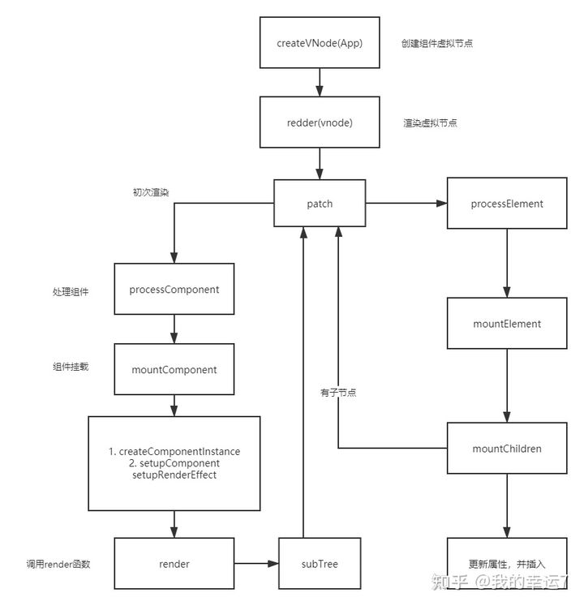

#### 渲染流程实现原理
#### vue3的类型处理
ShapeFlag.ts
shared文件夹中有个ShapeFlag.ts文件，其中ShapeFlags是为了实现快速判断组件类型而定义的枚举类型
```javascript
export const enum ShapeFlags {  // JS位运算，不是TS语法
    ELEMENT = 1,                    // 00000001 -> 1
    FUNCTIONAL_COMPONENT = 1 << 1,  // 00000010 -> 2
    STATEFUL_COMPONENT = 1 << 2,    // 00000100 -> 4
    TEXT_CHILDREN = 1 << 3,         // 00001000 -> 8
    ARRAY_CHILDREN = 1 << 4,        // 00010000 -> 16
    SLOTS_CHILDREN = 1 << 5,        // 00100000 -> 32
    TELEPORT = 1 << 6,              // ...
    SUSPENSE = 1 << 7,
    COMPONENT_SHOULD_KEEP_ALIVE = 1 << 8,
    COMPONENT_KEPT_ALIVE = 1 << 9,
    COMPONENT = ShapeFlags.STATEFUL_COMPONENT | ShapeFlags.FUNCTIONAL_COMPONENT     // 00000110
}
```
位运算是类型处理和权限校验的最佳实践
```javascript
// 00000001 & 00000001 => 00000001
// 未知组件 & ShapeFlags.ELEMENT => 00000001  只要 & 出来的结果不是0，就说明他是元素组件
if(xxx & ShapeFlags.ELEMENT){
    // 处理 element
}
​
// COMPONENT = ShapeFlags.STATEFUL_COMPONENT | ShapeFlags.FUNCTIONAL_COMPONENT
// 00000100 | 00000010 => 00000110 
if(xxx & ShapeFlags.COMPONENT){
    // 只要 & 出来结果不为 0 ，就既可能是 状态组件 ，又可能是 函数组件
}
```

#### 初始化渲染逻辑


patch

初次调用render方法时，虚拟节点类型为组件

```javascript
const processElement = (n1, n2, container) => {
​
}
const mountComponent = (initialVNode, container) => {
    // 组件初始化
}
const processComponent = (n1, n2, container) => {
    if (n1 == null) {
        mountComponent(n2, container)
    }
}
const patch = (n1, n2, container) => {
    const { shapeFlag } = n2;
    if (shapeFlag & ShapeFlags.ELEMENT) {
        processElement(n1, n2, container); // 处理元素类型
    } else if (shapeFlag & ShapeFlags.STATEFUL_COMPONENT) {
        processComponent(n1, n2, container); // 处理组件类型
    }
}
​
const render = (vnode, container) => {
    patch(null, vnode, container); // 初始化逻辑老的虚拟节点为null
}
```
#### 组件渲染流程
组件创建实例-组件的渲染流程
根据虚拟节点创建组件实例 - createComponentInstance()
将数据解析到实例上 - setupComponent()
创建effect，让render执行 - setupRenderEffect()
```javascript
const mountComponent = (initialVNode, container) => {
        // 1. 先有实例
        const instance = initialVNode.component = createComponentInstance(initialVNode)
        // 2. 需要的数据解析到实例上
        setupComponent(instance);
        // 3. 创建一个effect 让render执行
        setupRenderEffect(instance, container);
    }
```
创建组件实例
```javascript
// runtime-core/src/component.ts
export function createComponentInstance(vnode) {
    const type = vnode.type;
    const instance = { // 组件实例
         __v_isVNode: true,
        vnode,          // 组件对应的虚拟节点
        subTree: null,  // 组件要渲染的子元素
        type,           // 组件对象
        ctx: {},        // 组件的上下文
        props: {},      // 组件的属性
        attrs: {},      // 元素本身的属性
        slots: {},      // 组件的插槽
        setupState: {}, // 组件setup的返回值
        isMounted: false // 组件是否被挂载？
    }
    instance.ctx = { _: instance };
    return instance
}
```
拓展instance
```javascript
export function setupComponent(instance){
    const {props,children} = instance.vnode;
    // 根据props解析出 attrs 和 props ，将其放在 instan上
    instance.props = props;         // 1.初始化属性 initProps()
    instance.children = children;   // 2.初始化插槽 initSlot()
​
    // 需要先看一下当前组件是不是有状态的组件，函数组件
    let stateful = instance.vnode.shapeFlag & ShapeFlags.STATEFUL_COMPONENT
    if(stateful){   // 表示现在是一个带状态的组件
        // 调用 当前实例的setup 方法，用setup的返回值填充 setupState 和对应的 render 方法
        setupStatefulComponent(instance)
    }
}
```
实例属性代理
代理的handler
```javascript
// runtime-core/src/componentPublicInstance.ts
import { hasOwn } from "@vue/shared/src"
​
export const PublicInstanceProxyHandlers = {
    get({ _: instance }, key) {
        // 取值时 要访问 setupState props data
        const { setupState, props, data } = instance
        if(key[0] == '$'){
            return; // 不能取 $ 开头的属性
        }
        if (hasOwn(setupState, key)) {
            return setupState[key];
        } else if (hasOwn(props, key)) {
            return props[key];
        } else if (hasOwn(data, key)) {
            return data[key];
        } else {
            return undefined;
        }
    },
    set({ _: instance }, key, value) {
        const { setupState, props, data } = instance;
        if (hasOwn(setupState, key)) {
            setupState[key] = value
        } else if (hasOwn(props, key)) {
            props[key] = value
        } else if (hasOwn(data, key)) {
            data[key] = value
        }
        return true;
    }
}
```

提供instance.proxy, 代理实例上一系列属性
```javascript
// runtime-core/src/component.ts
function setupStatefulComponent(instance){
    // 1. 代理  传递给 render 函数的参数
    instance.proxy = new Proxy(instance.ctx,PublicInstanceProxyHandlers as any)
    // 2. 获取组件的类型，拿到组件的 setup 方法
    let Component = instance.type
    let { setup } = Component;
    
    if(setup){  // 有 setup 再创建执行上下文的实例
        let setupContext = createSetupContext(instance);
        const setupResult = setup(instance.props,setupContext);
        // instance 中 props attrs slots emit expose 会被提取出来，因为开发过程中会使用这些属性
        handlerSetupResult(instance,setupResult)
    }else{
        finishComponentSetup(instance); // 完成组件的启动
    }
}
​
function handlerSetupResult(instance,setupResult){
    if(isFunction(setupResult)){
        instance.render = setupResult
    }else if(isObject(setupResult)){
        instance.setupState = setupResult
    }
    finishComponentSetup(instance);
}
​
function createSetupContext(instance){
    return {
        attrs: instance.attrs,
        slots: instance.slots,
        emit: ()=>{},
        expose: ()=>{}
    }
}
​
function finishComponentSetup(instance){
    let Component = instance.type
​
    if(!instance.render){
        // 对template 模板编译产生render函数
        if(!Component.render && Component.template){
            // 编译 将结果 赋予给 Component.template
        }
        instance.render = Component.render;
    }
    // console.log(instance);
    
    // 对Vue2.0 的API 做兼容
    // applyOptions  循环
    // applyOptions(instance,Component);
}
```
初始化渲染effect
给组件增加渲染effect，保证组件中数据变化可以重新进行组件的渲染
```javascript
// runtime-core/src/renderer.ts
const setupRenderEffect = (instance, initialVNode, container) => {
    instance.update = effect(function componentEffect(){
        if(!instance.isMounted){
            const proxyToUse = instance.proxy; // 实例中的代理属性
            // vue2 _vnode $vnode
            // vue3 vnode subTree
            const subTree = (instance.subTree = instance.render.call(proxyToUse,proxyToUse));
            patch(null,subTree,container); // 渲染子树
            initialVNode.el = subTree.el; // 组件的el和子树的el是同一个
            instance.isMounted = true; // 组件已经挂载完毕
        }else{
            console.log('更新逻辑')
        }
    })
}
```
#### 元素创建流程
h 方法实现原理
h方法的几种情况
只有两个参数 类型 + 孩子 / 类型 + 属性
三个参数 最后一个不是数组
超过三个 多个参数
```javascript
// runtime-core/src/h.ts
import { isArray, isObject } from "@vue/shared/src";
import { createVNode, isVnode } from "./vnode";
​
export function h(type, propsOrChildren, children) {
    const l = arguments.length; // 儿子节点要呢是字符串，要么是数组，针对的是 createVnode 
    if (l == 2) {    // 类型 + 属性 /  类型 + 孩子
        // 如果 propsOrChildren 是数组，直接作为第三个参数
        if (isObject(propsOrChildren) && !isArray(propsOrChildren)) {
            if (isVnode(propsOrChildren)) {
                return createVNode(type, null, [propsOrChildren]);
            }
            return createVNode(type, propsOrChildren);
        } else {  // 如果第二个属性是不是对象，一定是孩子
            return createVNode(type, null, propsOrChildren);
        }
    } else {
        if (l > 3) {
            children = Array.prototype.slice.call(arguments, 2)
        } else if (l === 3 && isVnode(children)) {
            children = [children];
        }
        return createVNode(type,propsOrChildren,children);
    }
}
```

创建真实节点
```javascript
const mountElement = (vnode, container) => {
    // 创建节点保存到vnode中 递归渲染
    const { props, shapeFlag, type, children } = vnode
    let el = vnode.el = hostCreateElement(type);
​
    if (shapeFlag & ShapeFlags.TEXT_CHILDREN) { // 文本直接插入即可
        hostSetElementText(el, children);
    } else if (shapeFlag & ShapeFlags.ARRAY_CHILDREN) {
        mountChildren(children, el)
    }
    if (props) { // 处理属性
        for (const key in props) {
            hostPatchProp(el, key, null, props[key])
        }
    }
    hostInsert(el, container)
}
```

子节点的处理
```javascript
// runtime-core/src/renderer.ts
const mountChildren = (children, container) => {
    for (let i = 0; i < children.length; i++) {
        const child = normalizeVNode(children[i]);
        patch(null, child, container)
    }
}
const processText = (n1,n2,container) =>{
    if(n1 == null){ // 创建文本插入到容器中
        hostInsert(n2.el = hostCreateText(n2.children),container)
    }
}
```

normalizeVNode对节点进行标识
```javascript
// runtime-core/src/vnode.ts
export const Text = Symbol('Text')
export function normalizeVNode(child) { 
    if(isObject(child)){
        return child
    }
    return createVNode(Text,null,String(child));
}
```

#### 总结
组件渲染原理：将组件变成vnode -> 将vnode变成真实dom -> 插入页面
render方法的作用：可以渲染一个虚拟节点，将它挂载具体的dom元素上
vue3 的执行的核心就在patch这个方法上
组件创建过程

创建一个instance实例
根据用户传入的组件，拿到对应的内容，来填充这个instance实例
创建effect，并调用render方法，数据会将对应的effect收集起来
拿到render方法返回的结果，再次走渲染流程（patch）

组件渲染顺序先父后子，执行顺序是深度优先

每个组件都是一个effect函数


