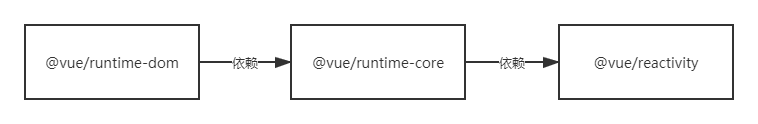

## 初始化流程原理
###  VueRuntimeDOM
#### runtime-dom



Vue3中将模块分为runtime-core和其他平台对应的运行时，其中runtime-dom是专门用来解决浏览器运行时的，这个包中提供了DOM属性操作和节点操作的一系列接口

#### patchProp
patchProp主要针对不同属性提供不同的patch操作
```javascript
import { patchClass } from "./modules/class"; // 类名处理
import { patchStyle } from "./modules/style"; // 样式处理
import { patchEvent } from "./modules/events"; // 事件处理
import { patchAttr } from "./modules/attrs"; // 属性处理
​
export const patchProp = (el,key,prevValue,nextValue) => {
    switch (key) {
        // 先处理特殊逻辑
        case 'class':
            patchClass(el,nextValue)
            break
        case 'style':
            patchStyle(el,prevValue,nextValue)
            break;
        default:
            if(/^on[A-Z]/.test(key)){ // 如果是事件
                patchEvent(el,key,nextValue)
            }else{  // 否则是属性
                patchAttr(el,key,nextValue);
            }
            break;
    }
}
```

#### patch实现
runtime-dom下的modules文件夹下就是各种patch的实现原理

patchClass
```javascript
export const patchClass = (el,value)=>{
    if(value == null){
        value = '';
    }
    el.className = value;// 设置样式名
}
```

patchStyle

```javascript
export const patchStyle = (el, prev, next) => {
    const style = el.style;
    if (!next) {
        el.removeAttribute('style');
    } else {
        for (const key in next) {
            style[key] = next[key];
        }
        if (prev) {
            for (const key in prev) {
                if (next[key] == null) {
                    style[key] = '';
                }
            }
        }
    }
}
```

patchEvent

给元素缓存一个绑定事件的列表
如果缓存中没有缓存过来的，而且value有值，需要绑定方法，并缓存起来
以前绑定过，需要删除掉，删除缓存
如果前后都有，直接改变 invoker 中 value 属性指向新的事件即可


```javascript
export const patchEvent = (el, rawName, nextValue) => {
    // 对函数的缓存
    const invokers = el._vei || (el._vei = {});
    const exisitingInvoker = invokers[rawName];
    if (nextValue && exisitingInvoker) { // 如果绑定过，则替换为新的
        exisitingInvoker.value = nextValue;
    } else {
        const name = rawName.slice(2).toLowerCase();
        if (nextValue) {  // 绑定新值
            const invoker = (invokers[rawName] = createInvoker(nextValue));
            el.addEventListener(name, invoker);
        } else if (exisitingInvoker) {    // 以前绑了，当前没有 value
            el.removeEventListener(name, exisitingInvoker);
            invokers[rawName] = undefined;
        }
    }
}
function createInvoker(initialValue) {
    const invoker = (e) => {
        invoker.value(e);
    }
    invoker.value = initialValue;  // 为了能随时更改 value 值
    return invoker;
}
```

patchAttr

```javascript
export const patchAttr = (el, key, value) => {
    if (value == null) {
        el.removeAttribute(key);
    } else {
        el.setAttribute(key, value);
    }
}
```

### nodeOps实现
nodePos中存放着所有节点的操作方法
```javascript
export const nodeOps = {
    insert: (child, parent, anchor) => { // 增加
        parent.insertBefore(child, anchor || null)
    },
    remove: child => { // 删除
        const parent = child.parentNode
        if (parent) {
            parent.removeChild(child);
        }
    },
    // 创建元素
    createElement: tag => document.createElement(tag),
    // 创建文本
    createText: text => document.createTextNode(text),
    // 设置元素内容
    setElementText: (el, text) => {
        el.textContent = text
    },
    // 设置文本内容
    setText: (node, text) => {
        node.nodeValue = text
    },
    parentNode: node => node.parentNode, // 获取父节点
    nextSibling: node => node.nextSibling, // 获取下个兄弟
    querySelector: selector => document.querySelector(selector)
}
```
